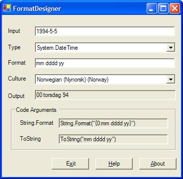

# Welcome to FormatDesigner

FormatDesigner is an application to experiment with the format strings used to
format data in [`String.Format`](https://msdn.microsoft.com/en-us/library/system.string.format.aspx)
and various type's [`ToString`](https://msdn.microsoft.com/en-us/library/system.iformattable.tostring.aspx)
functions.

Send your comments to [Chris Sells](mailto:csells@sellsbrothers.com).

Enjoy.

## Limitations

* This version is just an initial cut at an application like this. Ideally, the
  Format text box would be a combo box with all kinds of example formats (like
  those listed in [the Format Specifiers appendix of C# in a Nutshell, by Drayton
  et al](http://www.oreilly.com/catalog/csharpnut/chapter/appb.pdf).

## History

* 8/12/03: Atif Aziz sent along code to change the culture interactively. Thanks,
  Atif! I also took this opportunity to sort the Type field and resize the main
  window to be a bit larger for those hard to reach format strings.

* 8/6/03: Initial release (including a fix for a minimum/maximum size bug
  reported by Kevin Dente)

## License

Copyright &copy; 2003-2015 Chris Sells

Permission is hereby granted, free of charge, to any person obtaining a copy
of this software and associated documentation files (the "Software"), to deal
in the Software without restriction, including without limitation the rights
to use, copy, modify, merge, publish, distribute, sublicense, and/or sell
copies of the Software, and to permit persons to whom the Software is
furnished to do so, subject to the following conditions:

The above copyright notice and this permission notice shall be included in
all copies or substantial portions of the Software.

THE SOFTWARE IS PROVIDED "AS IS", WITHOUT WARRANTY OF ANY KIND, EXPRESS OR
IMPLIED, INCLUDING BUT NOT LIMITED TO THE WARRANTIES OF MERCHANTABILITY,
FITNESS FOR A PARTICULAR PURPOSE AND NONINFRINGEMENT. IN NO EVENT SHALL THE
AUTHORS OR COPYRIGHT HOLDERS BE LIABLE FOR ANY CLAIM, DAMAGES OR OTHER
LIABILITY, WHETHER IN AN ACTION OF CONTRACT, TORT OR OTHERWISE, ARISING FROM,
OUT OF OR IN CONNECTION WITH THE SOFTWARE OR THE USE OR OTHER DEALINGS IN
THE SOFTWARE.

Portions copyright &copy; 2002-2003 Chris Sells [http://www.sellsbrothers.com/](http://www.genghisgroup.com/)